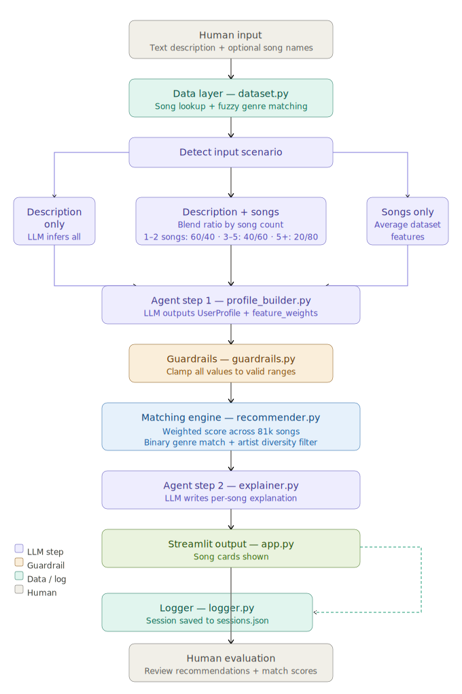

# Agentic Music Recommender System

A full agentic AI system that takes a natural language description of what you want to hear, builds a structured preference profile using an LLM, matches it against a 81k+ unique song Spotify dataset, and explains why each result fits — all in a Streamlit interface.

---
## Video Link
https://drive.google.com/file/d/17DBkNeqCmVOSWZPECu7_IByo83TRVhJL/view?usp=sharing

---
## Original Project

This project extends **Music Recommender Simulation** (Modules 1–3), a content-based recommender built in Python. The original system represented user taste as a hand-coded preference dictionary (genre, mood, energy, tempo, valence, danceability, acousticness) and scored songs against it using a fixed weighted formula. It ran entirely from the command line against a small 20-song CSV catalog and had no LLM integration, no natural language input, no explanation layer, and it didn't have dynamic feature and feature weight inference.

---

## What This Project Does and Why It Matters

Most music recommenders are black boxes — they surface results but never say why. This system is different: it lets users describe what they want in plain language, intelligently infers their audio preferences using a two-step LLM pipeline, matches those preferences against real Spotify track data, and then explains each recommendation in conversational terms.

It demonstrates how LLMs can act as structured reasoning agents — not just chatbots — by parsing unstructured input, extracting entities, inferring numeric feature values, and producing validated, machine-readable output that feeds directly into a deterministic scoring engine.

---

## Architecture Overview


---

## Setup Instructions

### 1. Clone and install dependencies

```bash
git clone <repo-url>
cd applied-ai-system-final
python -m venv .venv
source .venv/bin/activate        # Mac/Linux
# .venv\Scripts\activate         # Windows
pip install -r requirements.txt
```

### 2. Download the dataset

Download the **Spotify Tracks Dataset** by Maharshi Pandya from Kaggle:
[kaggle.com/datasets/maharshipandya/-spotify-tracks-dataset](https://www.kaggle.com/datasets/maharshipandya/-spotify-tracks-dataset)

Place the CSV at:
```
data/spotify_tracks.csv
```

### 3. Set your API key

Create a `.env` file in the project root:
```
GEMINI_API_KEY = your_key_here
GEMINI_MODEL = gemini-3-flash-preview
```

Get a free Gemini API key at [aistudio.google.com](https://aistudio.google.com).

### 4. Run the Streamlit app

```bash
python -m streamlit run app.py
```


---

## Sample Interactions (Images)

### Example 1 — Descriptive text only


---

### Example 2 — Song references only

---

### Example 3 — Mixed input (text + songs)

---

## Design Decisions

**Why deduplication?**
The dataset contained duplicate rows for the same song due to the song being in multiple albums and in multiple genres. I deduplicated it so the most popular row per song stays. The tradeoff is we lose other genres or albums. Albums isn't an issue, but we lose off on the other genres. This could be handled by combined all genres into one, but I chose to leave it for now. 

**Why vectorized pandas scoring instead of a loop?**
The dataset has 81k+ rows after deduplication. Row-by-row scoring in Python would take several seconds. Vectorized operations run in under 100ms. This allows for easy feature_weight * difference multiplication across all columns quickly. 


**Why floor genre weight at 0.5?**
The dataset is heavily skewed toward Indian pop and bhangra. Without a genre floor, some songs of very similar tastes would consistently outscore everything else based on pure audio features alone. The 0.5 floor ensures genre remains a meaningful filter regardless of what the LLM assigns.

**Why artist diversity enforcement?**
Early testing showed the top 5 could easily be 3–4 songs from one prolific artist (e.g. Drake, Taylor Swift) when their catalog closely matched the profile. Enforcing one song per artist makes results more useful and surprising.

**Trade-offs:**
- Deduplication by `track_id` then `(track_name, artists)` means a song keeps its most-popular genre tag, which may not be the most accurate for niche releases
- The genre floor of 0.5 slightly penalizes profiles where genre genuinely shouldn't matter (e.g. pure instrumental searches), though `match_genre()` zeroes the weight entirely when no genre is identified, but this allows for more emphasis on a specific genre where present
- Two LLM calls per request adds latency, but the separates the profile building from the explanation step

---

## Testing Summary

**What worked:**
- The program works. We can pass in song descriptions and example songs and it gives recommendations. 
- Guardrails are present in case of issues of response from the LLM. However, this didn't present an issue so far, likely due to passing in feature infomation and JSON schema directly into each prompt so the LLM already knows what to provide, but the clamping is there as a safety measure. 
- Genre weight flooring visibly improved result diversity
- Deduplicating removed the duplicates
- The artist diversity filter eliminated repeated artists from the top 5 in all test cases
- Logging works and any issue or success is properly logged inside logs/


**What didn't work / required iteration:**
- It required some planning and iterations to perfect how to build the profile, specifically how to handle general descriptions vs example songs vs blend of both. I had to work with the LLM to decide how we wanted it to infer the importance of the various features and how to assign the target values when creating the User Profile. 
- Without the genre weight floor, results were dominated by Indian pop (dataset bias), which wasn't obvious until testing with English-language prompts
- Relative imports broke when switching between `python3 src/main.py` and `python -m src.main` — required `__init__.py` and consistent use of `python -m`
- The artist field uses `;` as a separator for collaborations — the initial exact-string artist dedup check missed this, allowing the same artist to appear twice under different featured-artist strings

**What I learned:**
- Dataset quality and bias matter as much as algorithm design; a beautifully tuned scorer is useless if the data it runs on is skewed
- Separating concerns (extract → validate → score → explain) made it easy to go step by step and ensure each component works before moving to next
- Using LLM to research, create a plan, create phases to execute plan, and then execute the plan in phases.
- AI is a powerful tool and can do a lot of heavy lifting and coding, but it does require human guidance. It may be able to do a lot, but can easily make small bugs or forget something. I learned to guide it as needed and supervising it while it wrote, which made it very efficient to complete this project. 

---

## Reflection

Building this project changed how I think about where LLMs fit in a system. It was truly a powerful tool. It let me research, create a plan, create phases to execute plan, and then execute the plan in phases. But AI is a powerful tool and can do a lot of heavy lifting and coding, but it does require human guidance. It may be able to do a lot, but can easily make small bugs or forget something. I learned to guide it as needed and supervising it while it wrote, which made it very efficient to complete this project. It also needs context and information and the more detailed you are, the better it can be at doing what you need it to do. It doesn't know your dataset until you tell it how it's built. It is a really good planner but only if you properly guide it. One shotting is a terrible idea especially if you don't know how to go about the project. 
